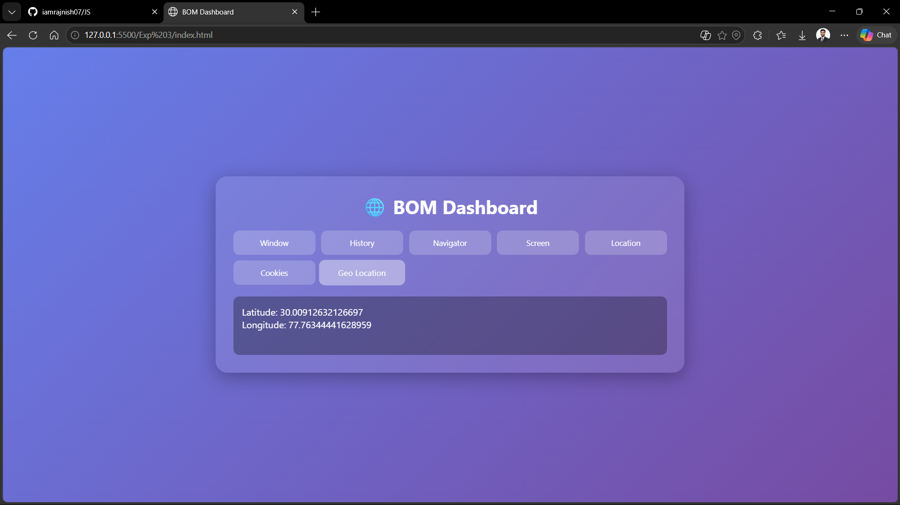
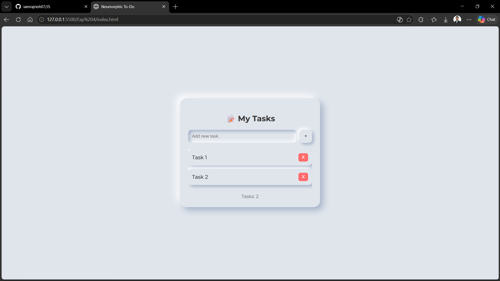
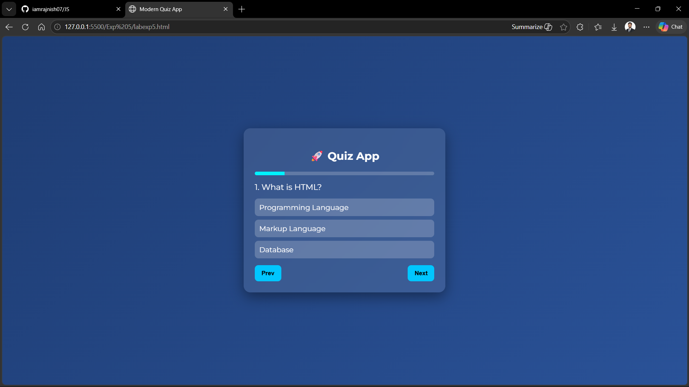

# 🌐 JavaScript Lab Experiments

---

## 📌 Experiments Included

### 3 Browser Object Model (BOM) Demo

### 4 To-Do List using DOM

### 5 Interactive Quiz Application

---

# 1. Browser Object Model (BOM) Demo

## Description

This experiment demonstrates the usage of various **Browser Object Model (BOM)** objects in JavaScript.
It helps understand how JavaScript interacts with the browser environment.

## Concepts Used

* Window Object
* History Object
* Navigator Object
* Screen Object
* Location Object
* Cookies
* Geolocation API

## Features

* Display browser window size
* Show browsing history length
* Detect browser details
* Get screen resolution
* Fetch current URL information
* Store and display cookies
* Access user’s geographical location

## Output Screenshot

*Add your screenshot here*

---

# 4. To-Do List using DOM

#Description

A dynamic **To-Do List Web Application** built using DOM manipulation.
Users can add, delete, and manage tasks efficiently.

## Concepts Used

* DOM Manipulation (`createElement`, `appendChild`)
* Event Handling
* `querySelector` / `getElementById`
* Local Storage

## Features

* Add new tasks
* Delete individual tasks
* Delete all tasks
* Task counter
* Mark tasks as completed
* Save tasks using localStorage
* Add task using Enter key

## Output Screenshot

---

# 🧪 5. Interactive Quiz Application

## Description

A modern **Quiz Application** that allows users to answer multiple-choice questions and get instant results.

## Concepts Used

* Arrays & Objects
* DOM Rendering
* Event Handling
* State Management

## Features

* Multiple choice questions
* Next/Previous navigation
* Progress bar
* Score calculation
* Result display with feedback
* Restart quiz option

## Output Screenshot

---

# Technologies Used

* HTML5
* CSS3
* JavaScript (ES6)

---

